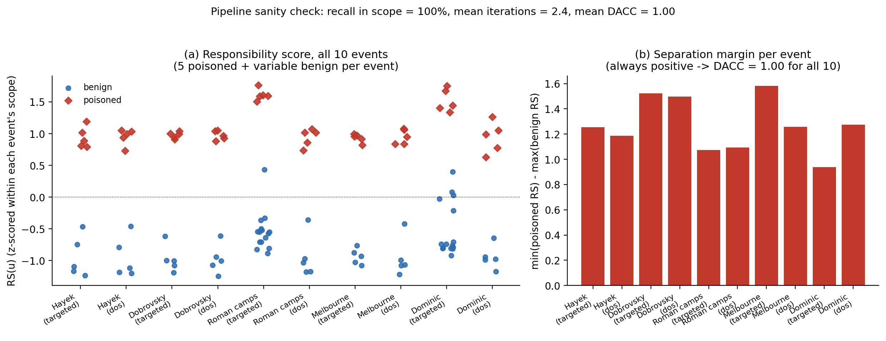
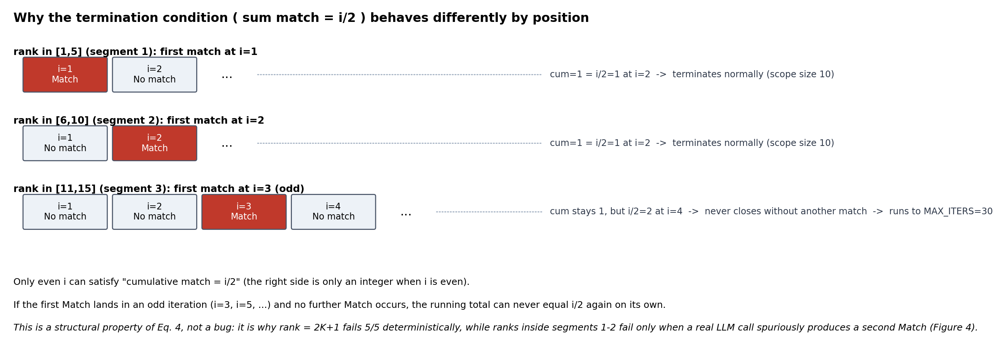
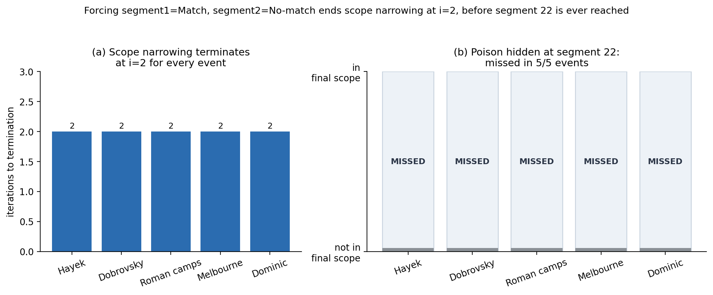
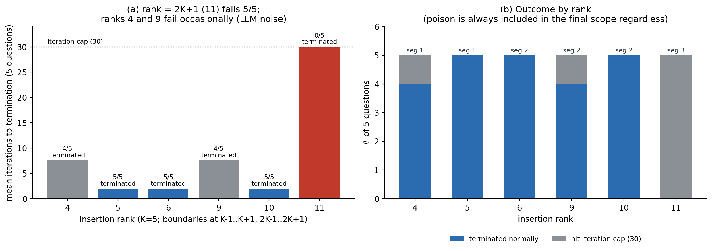
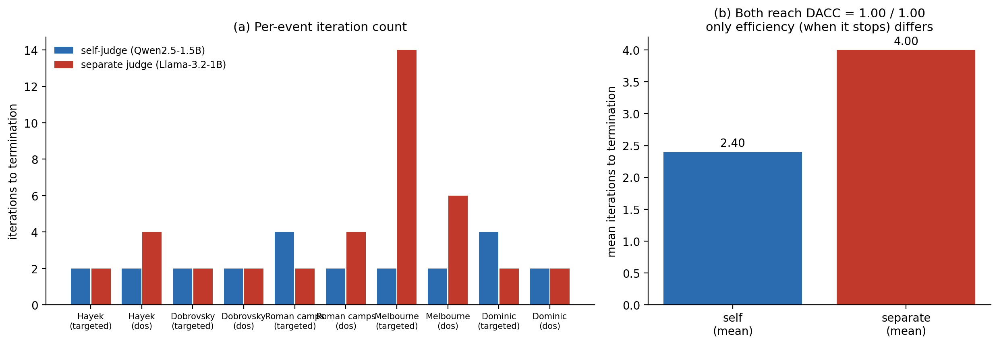
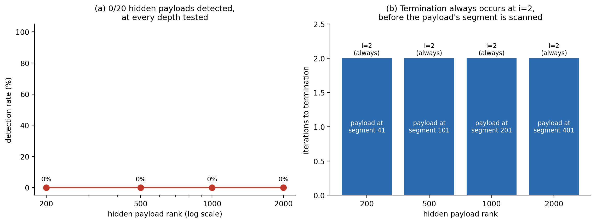
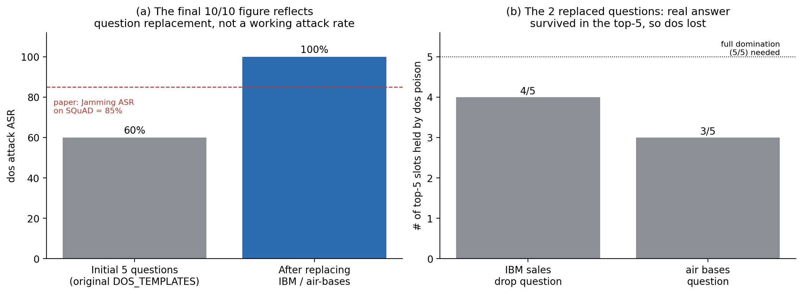

# RAGOrigin Edge Case Reproduction (Lightweight Replication)

A lightweight replication and edge-case investigation of [IEEE S&P'26] [*"Who Taught the Lie? Responsibility Attribution for Poisoned Knowledge in RAG"*](https://arxiv.org/abs/2509.13772) (RAGOrigin).

**The goal is not to reproduce SOTA-level numbers, but to replicate, on a low-cost GPU with lightweight models, that Algorithm 1 (attribution scope narrowing) and the Responsibility Score (Eq. 5-8) behave as described in the paper, and to directly measure boundary conditions the paper does not explicitly address.**

**Terms used throughout.** *Misgeneration event* (q, r): a user question q and the incorrect response r the RAG system produced. *Attribution scope* U: the subset of the poisoned database that scope narrowing selects for scoring. *Segment*: K=5 consecutive texts, ranked by similarity to q. *Match / No-match*: whether an LLM's answer to a segment matches r (Eq. 3). *Termination condition* (Eq. 4): scope narrowing stops once the running count of Match segments equals half the iterations so far. *ES/SC/GC/RS*: embedding similarity, semantic correlation, generation characteristic, and their z-scored average, the responsibility score (Eq. 5-8). *DACC/FPR/FNR*: detection accuracy / false-positive / false-negative rate of the K-means(k=2) threshold on RS(u) inside the scope. *targeted / dos*: this project's two attack types (explicit wrong-answer statement vs. "ignore the context" instruction).

## Research questions and answers

| # | Question | Short answer |
|---|---|---|
| RQ1 | Do scope narrowing and the RS threshold work as the paper describes, at this scale? | **Yes.** Poisoned-text recall in scope = 100%, mean 2.4 iterations, DACC = 1.00 across all 10 events (Fig. 1). |
| RQ2 | Does early termination cause real misses? | **Yes.** Forcing Match-then-No-match at i=1,2 ends scope narrowing before a poison hidden at segment 22 is ever scanned — 5/5 (Fig. 3). |
| RQ3 | Is there a specific rank where scope narrowing structurally breaks down? | **Yes, from rank = 2K+1, when no poison sits in the top-K.** All 5/5 cases at rank 11 hit the 30-iteration cap instead of terminating; nearby ranks fail only occasionally, from real LLM judgment noise (Figs. 2, 4). |
| RQ4 | Does the judgment LLM's identity change detection accuracy or only efficiency? | **Only efficiency.** DACC = 1.00 either way; mean iterations differ (2.40 self vs. 4.00 separate) (Fig. 5). |
| RQ5 | Can an attacker who knows the system exploit early termination on purpose? | **Yes, completely.** 20/20 cases (5 questions x 4 depths up to rank 2000) evade detection (Fig. 6). |

---

## Setup

- **Corpus**: SQuAD (train split), 10,000 unique-context passages, seeded shuffle (5.24M in the paper's default SQuAD database — see [Deviations](#deviations-from-the-papers)). Retriever: `intfloat/e5-small-v2`, cosine similarity, K=5.
- **Target questions**: 5, each with a gold context inside the 10,000-passage corpus (so the benign RAG system can answer correctly).
- **Attacks**: `targeted` (explicit wrong-answer statement, PoisonedRAG-style) and `dos` (a fixed refusal template as the target answer, Jamming-style), M=5 poisoned texts per question per attack, giving 5 x 2 x 5 = 50 poisoned texts and 5 x 2 = 10 misgeneration events.
- **Models**: RAG generation LLM and judgment LLM = `Qwen2.5-1.5B-Instruct` (same model, i.e. self-judging) unless noted; proxy LLM for ES/SC/GC = the same `Qwen2.5-1.5B-Instruct`; Finding 3 additionally uses `Llama-3.2-1B-Instruct` as a separate judge.
- **Algorithm 1 / Eq. 4**: iterate over K=5-sized rank segments; stop once `sum(match) == i/2`, i.e. once the numbers of Match and No-match segments are equal — only satisfiable at even i. `results/sanity_check/scope_narrowing_log.json` records every iteration; `results/sanity_check/rs_scores_and_threshold.json` records ES/SC/GC/RS and the K-means verdict for every text in every final scope.

---

## Results

### 1. The pipeline behaves as the paper describes



**Figure 1. Sanity check across all 10 misgeneration events.** (a) RS(u) (z-scored within each event's own scope, Eq. 8) for every poisoned (n=5/event) and benign (n=5-15/event) text. (b) The separation margin, min(poisoned RS) - max(benign RS), is positive for every event (range 0.94-1.58), which is why the K-means(k=2) threshold gives DACC = 1.00 in every case. Mean iterations to termination = 2.4; poisoned-text recall within the final scope = 100% (n=50/50). Data: `sanity_check/scope_narrowing_log.json`, `sanity_check/rs_scores_and_threshold.json`.

- All 10 events terminate at i=2 or i=4 (never later), consistent with Eq. 4's parity constraint (see Fig. 2).
- The clean per-event separation (Fig. 1b) confirms the paper's claim that ES, SC, and GC jointly create a wide margin, even though this project uses ~1.5B-parameter models rather than GPT-4o-mini / Llama-3.1-8B.

### 2. Early termination causes a real missed detection



**Figure 2. Why Eq. 4's termination condition behaves differently by rank (schematic).** The condition `cumulative Match == i/2` can only be satisfied at even i. If poison sits in segment 1 or 2 (rank <= 10), either a Match at i=1 is followed by a No-match at i=2, or a No-match at i=1 is balanced by a Match at i=2 — both terminate at i=2. If segment 1 is a No-match and poison first appears at i=3 or later (rank >= 11, segment 3 onward) with no further Match, the Match count can never catch up with the No-match count, so the running total stays below i/2 at every later i, odd or even — this is a structural property of Eq. 4, not a bug, and it does not depend on model quality. (The "(odd)" labels inside the figure are imprecise: a first Match at i=4 fails the same way; the cause is the Match deficit, not the parity of i.)



**Figure 3. Forced early termination misses a deep poison.** Segment 1 is forced to Match (the same 5 poisoned texts used in the original misgeneration event) and segment 2 to No-match (5 natural benign texts) for all 5 questions; a sixth poisoned text is planted at segment 22 (rank 106-110). (a) All 5 events terminate at i=2, as Figure 2's top case predicts. (b) The segment-22 poison is outside the size-10 final scope in 5/5 cases — it is never scored, so it cannot be flagged regardless of how well RS separates poisoned from benign text. Data: `early_termination_attack/early_termination_result.json`.

This experiment does not require an adversary; it can happen whenever poison also occurs early by chance. Finding 5 asks whether an adversary can force it deliberately at arbitrary depth.

### 3. Rank = 2K+1 is where scope narrowing structurally breaks down



**Figure 4. Detection outcome by insertion rank.** A single poisoned text was inserted at rank in {4, 5, 6, 9, 10, 11} = {K-1, K, K+1, 2K-1, 2K, 2K+1} for each of the 5 targeted-attack questions, and Algorithm 1 was run to completion or to a 30-iteration cap. (a) Rank 11 (segment 3, first Match at i=3) hits the cap in 5/5 cases, exactly as Figure 2 predicts. Ranks 4 and 9 (segments 1-2, where the mechanics of Fig. 2 predict clean termination at i=2) still fail in 1/5 cases each — real LLM judgment calls occasionally produce a spurious second Match in a later segment, which prevents the count from closing at i=2. Ranks 5, 6, 10 terminate 5/5. (b) The poison is still included in the final scope in all 30 cases (even the ones that hit the cap), because the cap forces the scope to grow to 150 texts — but "included" here means the algorithm scanned nearly the whole corpus, not that it terminated efficiently. Data: `position_coverage_curve/coverage_curve_result.json`.

**Scope of this finding.** Unlike the other experiments, segment 1 is judged by the LLM here rather than fixed to Match, and the only poison lies outside the top-K. Under the author's implementation, where segment 1 of a real misgeneration event is fixed to Match, this non-termination cannot occur: the Match count starts ahead and must pass through equality (and terminate) before it can fall behind. This finding is therefore a boundary condition showing a second way Eq. 4's termination rule is fragile; in practice it could arise, for example, when attribution is re-run to find poison remaining after the top-K poisons have been removed (not tested here). Per-iteration Match/No-match judgments were not saved for this experiment (`coverage_curve_result.json` keeps only summary fields), so the Match at i=3 is inferred from the design rather than logged.

The earlier version of this README described the rank=11 failure as purely structural and did not report that ranks 4 and 9 also fail some of the time; the position-by-position breakdown in Figure 4a makes that distinction explicit.

### 4. Judgment-LLM identity changes efficiency, not accuracy



**Figure 5. Self-judging vs. a separate judge, same 10 events.** (a) Per-event iteration count with `Qwen2.5-1.5B-Instruct` judging its own generations ("self") vs. `Llama-3.2-1B-Instruct` as an independent judge ("separate"); the separate judge needs more iterations in 4/10 events, most sharply for the Melbourne (targeted) event (2 vs. 14). (b) Both configurations reach DACC = 1.00 for every event once a text is inside the final scope; the mean iteration count differs sharply (2.40 vs. 4.00). Data: `self_judgment_bias/self_judgment_bias_result.json`.

Because Llama-3.2-1B judges Match more strictly (requiring closer wording before agreeing r was reproduced), it needs more segments — and hence a larger final scope — before Eq. 4 is satisfied. This should be read as a difference in how readily each model calls something a Match, not as a difference in the two models' ability to separate poisoned from benign text once scored. Whether this specific pattern reflects genuine self-preference bias or simply a general difference in judgment strictness between the two models cannot be disentangled by this design alone (it would require, e.g., swapping only the RAG generation model while holding the judge fixed).

### 5. An attacker who knows the system can force early termination at will



**Figure 6. Adaptive termination-forcing attack.** Under the paper's strong-attacker assumption (Section 6.4: complete knowledge of the attribution system), segment 1 is set to the 5 real poisoned texts (forcing Match) and segment 2 to 5 natural benign texts (forcing No-match), guaranteeing termination at i=2 by the same mechanism as Figure 2's top case. A second, distinct poisoned text (a different template, so it is not literally one of the segment-1 texts) is hidden at rank 200 / 500 / 1000 / 2000 — i.e. segment 41 / 101 / 201 / 401. (a) 0/20 cases (5 questions x 4 depths) are detected. (b) Termination always occurs at i=2, regardless of how deep the second payload is placed, because Eq. 4 is satisfied long before the scope reaches that segment. Data: `adaptive_termination_attack/adaptive_termination_result.json`.

This is the same mechanism as Finding 2, but deliberately engineered: an attacker with knowledge of Eq. 4 does not need to hide the bulk of their payload near the top of the ranking at all — two segments' worth of Match/No-match manipulation caps the entire scope regardless of corpus size.

### DoS-attack ASR: lower than the paper, and the final 10/10 figure needs a caveat



**Figure 7. The dos attack's success rate on the original 5 questions, and why 2 were replaced.** *(Numbers transcribed by hand from `results/observation_dos_asr_note.md`; the underlying per-attempt log was not kept as JSON — `data/failed_attack_attempts.json` is empty in this snapshot.)* (a) On the original 5 target questions, the dos attack (with `Qwen2.5-1.5B-Instruct` as the RAG LLM) succeeded on 3/5 (60%), well below the paper's Jamming ASR on SQuAD without defenses (85%, Table 2). Three retries with more forceful instruction templates did not change the outcome (greedy decoding is deterministic given the same input). (b) For the 2 failing questions, the dos poison held only 4/5 and 3/5 of the top-5 retrieval slots — the real answer's context survived retrieval, and Qwen2.5-1.5B tended to answer from it rather than follow the "ignore the context" instruction. Those 2 questions were then replaced (Melbourne, Dominic) with ones where the dos poison achieves full 5/5 top-K domination, which is why the final `misgeneration_events.json` and every later experiment show dos succeeding 5/5.

**This is worth restating plainly: the 10/10 event grid used throughout Findings 1-6 is not evidence that this project's dos attack works as reliably as the paper's Jamming attack.** It is evidence that lightweight models are, on this small amount of evidence, somewhat more resistant to instruction-only DoS-style poisoning than GPT-4o-mini — and that the final dataset was selected (via question replacement, not via strengthening the attack) to reach 5/5 dos coverage regardless.

---

## Limitations

- **Poisoned texts are unoptimized and overt**: they repeat the question verbatim and either state the wrong answer directly or instruct the model to ignore context. There was no attempt to evade detection the way the paper's gradient-based or adaptive attacks do (Sections 6.4, 7 of the paper) beyond the two termination-forcing attacks in Findings 2 and 5, which target the *scope-narrowing* stage rather than the *responsibility-scoring* stage. This is likely why RS separation is as clean as Figure 1 shows — it does not mean RAGOrigin's scoring is flawless against optimized attacks, only that this project's non-adaptive attacks did not stress it.
- **Extreme scale-down**: 5 target questions and a 10,000-text corpus, vs. the paper's 5 datasets with 2.7-8.8M texts each and up to 100 collected misgeneration events per (attack, dataset) pair (see the [table below](#default-paper-conditions-vs-this-project)). None of the DACC/FPR/FNR numbers here should be read as comparable to the paper's Table 3.
- **Only 2 of the paper's 9 default attacks are implemented** (a targeted-answer style and a DoS style), out of PRAGB/PRAGW/ProInject/HijackRAG/LIAR (targeted) and Jamming/BadRAG/Phantom/AgentPoison (DoS); none of the 3 adaptive attacks from the paper's Section 6.4 (benign-text perturbation, poisoned-text perturbation, adversarial SC/GC perturbation) are implemented — Findings 2 and 5 here are a different, scope-narrowing-specific adaptive attack that the paper does not evaluate.
- **DoS ASR is below the paper's** (Finding above), and no root-cause experiment (e.g. varying model size) was run to confirm the "smaller models resist instruction-only jamming better" hypothesis.

## Default Paper Conditions vs. This Project

| Item | Paper default | This project |
|---|---|---|
| Dataset | 5 datasets (NQ/HotpotQA/MS-MARCO/BoolQ/SQuAD); SQuAD alone has 5,235,396 passages (98,169 questions) | SQuAD only, 10,000 passages |
| Retriever | E5-base-v2, cosine similarity | e5-small-v2, cosine similarity (lightweight, same family) |
| K (scope-narrowing segment size) | 5 | 5 (same) |
| M (poisoned texts per question) | 5 | 5 (same) |
| RAG response generation LLM | GPT-4o-mini (default) | Qwen2.5-1.5B-Instruct |
| Proxy LLM (ES/SC/GC computation) | Llama-3.1-8B (default; the paper also reports Qwen2.5-1.5B works comparably, Table 11) | Qwen2.5-1.5B-Instruct (same model as the generation LLM — a combination not evaluated in the paper) |
| Judgment LLM (match judging) | GPT-4o-mini (default; the paper also reports open-source judges of various sizes work comparably, Table 10) | baseline: Qwen2.5-1.5B-Instruct (self) / comparison: Llama-3.2-1B-Instruct (separate) |
| Attack types | 9 default SOTA poisoning attacks (5 targeted, 4 DoS-style), plus 3 adaptive attacks in Sec. 6.4 | 2 custom implementations (targeted: PoisonedRAG-style explicit wrong-answer statement / dos: Jamming-style "ignore context" instruction); the "adaptive" attacks here (Findings 2, 5) target scope narrowing, which the paper's 3 adaptive attacks do not |
| Target answer construction | LLM-generated random answer different from the correct one | Same approach (generated by Qwen, retried until different from the correct answer) |
| Number of target questions | Up to 100 successful instances collected per (attack, dataset) pair | 5 (chosen based on the project's time budget) |
| Threshold determination | K-means (k=2) on RS(u) | Same |
| Max scope-narrowing iterations | Not specified (implicitly bounded by corpus size) | 200 for the main pipeline (`04_scope_narrowing_sanity_check.py`, `05_...`), 30 for the position-coverage-curve experiment specifically (chosen because rank-11 cases do not terminate on their own) |

Because both the corpus scale (5.2M+ -> 10K) and the model scale (GPT-4o-mini/Llama-8B -> ~1-1.5B) were reduced drastically, directly comparing this project's DACC/FPR/FNR numbers to the paper's is not meaningful. The purpose here is structural verification and boundary-case observation, not SOTA reproduction.

## Relationship to the Author's Code

The author's official implementation (`external/RAG-Responsibility-Attribution`, cloned via `scripts/00_clone_author_repo.sh`) was consulted to cross-check the scope-narrowing, RS-computation, and K-means-threshold logic. Differences found and corrected during this cross-check:

1. **Match-judging target**: the initial implementation compared against the attacker's target answer (t), but both the author's code and the paper's definition (Eq. 3) correctly compare against the actually observed incorrect response (r) — this was fixed.
2. **"I don't know" handling**: the author's prompt explicitly instructs "say I don't know if you can't find the answer," and any such response is automatically treated as No-match — this was matched.
3. **Skipping recomputation of the first scope-narrowing segment**: since that segment's top-K is identical to the one already used when constructing the misgeneration event, it is fixed to Match without regenerating, exactly as the author's code does (saves one LLM call).

The RS computation method (HF `loss`-based vs. directly gathering log-softmax values) is mathematically equivalent, so it was left as originally implemented.

## Pipeline Structure

```
scripts/
  00_clone_author_repo.sh          # clones the author's official implementation for cross-checking
  benchmark_llm_latency.py         # measures LLM call latency, used for time-budget planning

  setup/
    01_build_corpus.py               # builds a 10,000-text corpus + 5 target questions + embeddings
    02_generate_poisoned_texts.py    # generates poisoned texts (targeted/dos x M=5 x 5 questions)
    03_build_misgeneration_events.py # verifies actual attack success -> builds (q, r) events
    03b_retry_failed_dos_attacks.py  # retries failed dos scenarios (to confirm genuine failure)
    03c_replace_failed_questions.py  # replaces questions that still fail after retry
    04_scope_narrowing_sanity_check.py       # verifies scope narrowing behaves correctly
    05_responsibility_score_and_threshold.py # verifies RS(u) + K-means threshold behave correctly

  early_termination_attack.py      # early-termination missed-detection experiment
  position_coverage_curve.py       # position-based detection-rate experiment
  self_judgment_bias.py            # judgment LLM self-judgment bias experiment
  adaptive_termination_attack.py   # adaptive termination-forcing evasion attack experiment
  06_figures/make_figures.py       # regenerates every figure in this README from results/

data/
  corpus.json                 # 10,000 {id, text} passages
  target_questions.json       # 5 {question, gold_context_id, correct_answer}
  poisoned_texts.json         # 50 {question, attack_type, target_answer, variant_id, text}
  misgeneration_events.json   # 10 {question, attack_type, incorrect_response, injected_poison_ids, ...}
  failed_attack_attempts.json # empty in this snapshot; see Figure 7's caption

results/
  sanity_check/                    scope_narrowing_log.json, rs_scores_and_threshold.json
  early_termination_attack/        early_termination_result.json
  position_coverage_curve/         coverage_curve_result.json
  self_judgment_bias/              self_judgment_bias_result.json
  adaptive_termination_attack/     adaptive_termination_result.json
  observation_dos_asr_note.md      the DoS ASR investigation, in Korean
  figures/                         5 figures produced during the investigation (see note below)

figures/            7 figures + figure_stats.json (numbers quoted in captions), regenerated for this README
```

**Note on `results/figures/` vs. `figures/`**: `results/figures/01-05` are figures produced during the original investigation; they are accurate except `02_early_termination.png`, whose right panel plotted "missed" cases as if they reached the "detected" bar height (a labeling bug, not a data error — the underlying `early_termination_result.json` was always correct). The `figures/` directory at the repository root is a full replacement, regenerated from `results/` by `scripts/06_figures/make_figures.py`, with that bug fixed and two additional figures (the Eq. 4 parity mechanics, Fig. 2; the DoS ASR observation, Fig. 7) not covered by the original five.

## Reproducing

```bash
# environment: see "Environment" below
# 1. corpus, poisoned texts, misgeneration events
python scripts/setup/01_build_corpus.py
python scripts/setup/02_generate_poisoned_texts.py
python scripts/setup/03_build_misgeneration_events.py
python scripts/setup/03b_retry_failed_dos_attacks.py   # only if step 3 reports dos failures
python scripts/setup/03c_replace_failed_questions.py   # only if retries still fail
# 2. pipeline sanity check
python scripts/setup/04_scope_narrowing_sanity_check.py
python scripts/setup/05_responsibility_score_and_threshold.py
# 3. edge-case experiments
python scripts/early_termination_attack.py
python scripts/position_coverage_curve.py
python scripts/self_judgment_bias.py
python scripts/adaptive_termination_attack.py
# 4. all figures, from results/ only (no GPU, no model calls)
python scripts/06_figures/make_figures.py
```

Caveats when re-running:

- Scripts read and write `~/projects/ragorigin/...`; adjust the paths.
- Steps 03b/03c are conditional: they only need to run if step 03 reports dos-attack failures on the current random seed, and they mutate `target_questions.json` / `misgeneration_events.json` in place — run step 03 first and inspect its output before deciding whether to run them.
- `position_coverage_curve.py` and `adaptive_termination_attack.py` re-run Algorithm 1 from scratch with a forced ordering; they do not reuse `sanity_check/scope_narrowing_log.json`.
- Seed: `random.seed(42)` in `01_build_corpus.py`. The other scripts do not set an explicit seed beyond what `01` fixes for corpus/question selection; greedy decoding (`do_sample=False`) makes LLM calls deterministic given the same input.
- No lock file is provided; the pinned package versions are not recorded.

## Environment

Single conda environment (`ragorigin`), with `sentence-transformers`, `transformers`, `torch`, `scikit-learn`, and `datasets`. Hardware: a single low-cost consumer GPU (RTX 2070 SUPER, 8 GB, per `benchmark_llm_latency.py`'s docstring). Under `external/` (git-ignored, populated by `scripts/00_clone_author_repo.sh`): [`RAG-Responsibility-Attribution`](https://github.com/zhangbl6618/RAG-Responsibility-Attribution) (the paper's official implementation).
